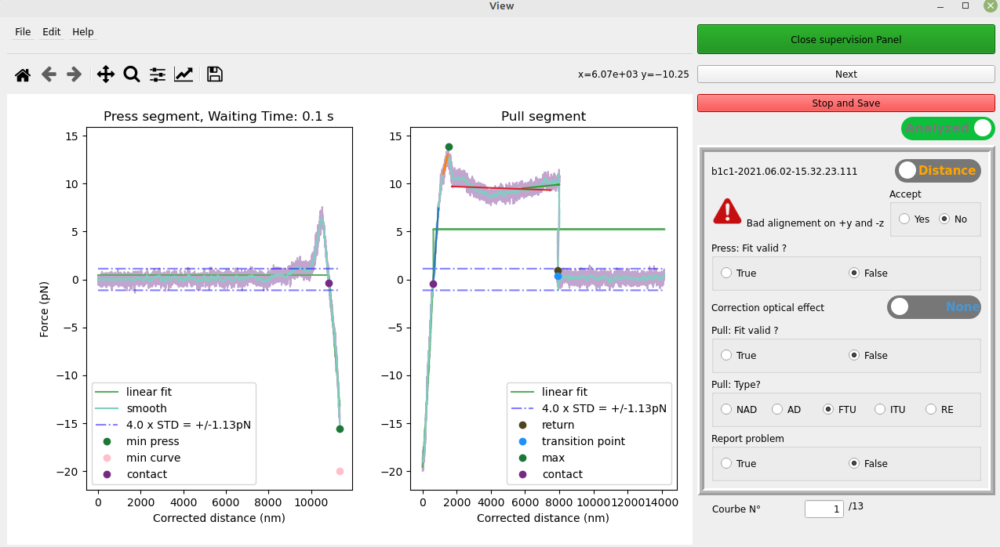
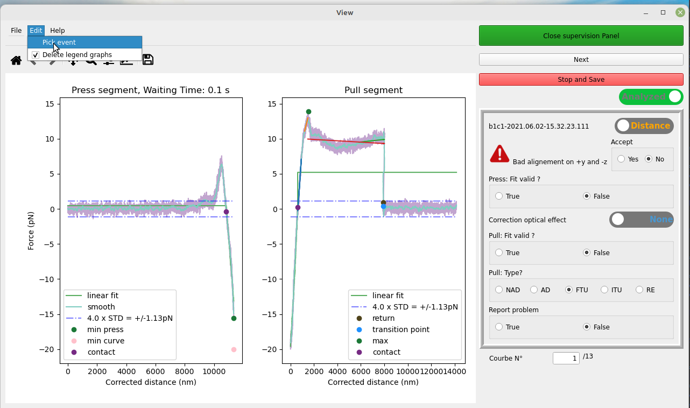
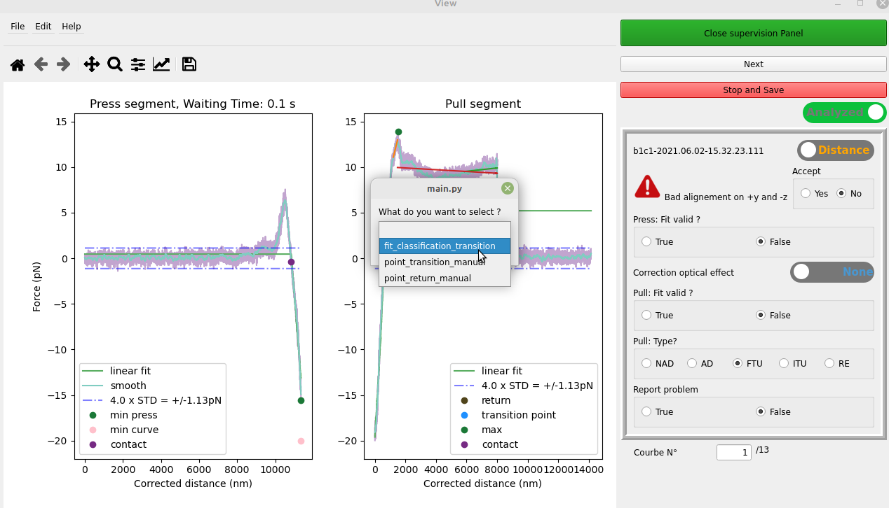
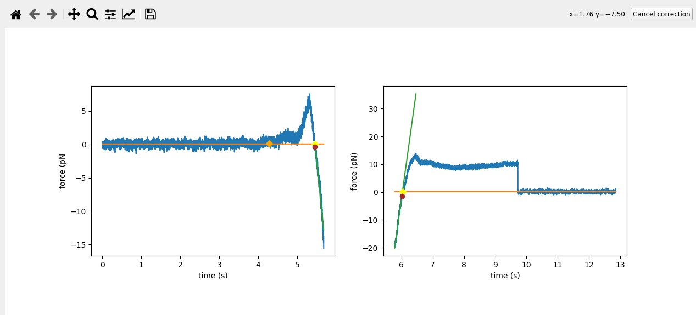
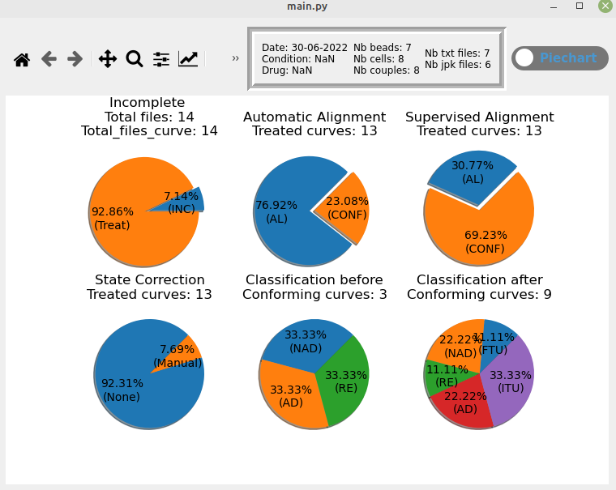
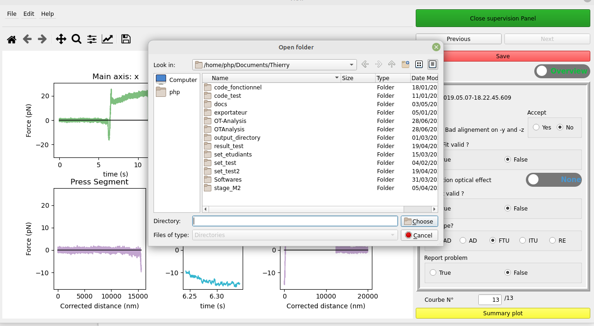

# <center> OT-Analysis : a software for rich analysis of force curves from optical tweezer (with living cells)</center>

<center>Thierry Galliano1, Guillaume Gay2,

Laurent Limozin1, Pierre-Henri Puech1</center>

1 : Inserm UMR 1067 / CNRS UMR 7333 / AMU UM61 / CENTURI ; Lab.Adhésion et Inflammation ; Marseille - France
2 : France Bio Imaging ; Montpellier – France

## Install MiniConda && Create conda environment
```
wget https://repo.anaconda.com/miniconda/Miniconda3-latest-Linux-x86_64.sh
chmod +x Miniconda3-latest-Linux-x86_64.sh
./Miniconda3-latest-Linux-x86_64.sh
```

## If OS system is Linux or Mac:
```
source .bashrc
```
Otherwise OS system Windows:<br>
Go to the application prompt conda or change the environment variable PATH

Then:
```
conda create -n newenv
conda activate newenv
```
## Install Package
```
conda install pip 
python -m pip install OTAnalysis
```
## Launch project
In a termnial, run (from anywhere):
```
otanalysis or OTAnalysis
```
## <center>Introduction</center>

Optical tweezers produce complex data that need to be sorted.
A classification software of the adhesion patterns allowing to categorize the curves and to retrieve the most important information for the recovery of significant results. The classification is done on the "Pull" segment according to 4 main types 
- NAD: non adhesion, 
- AD: adhesion, 
- FTU: finite membrane tube, 
- ITU: infinite membrane tube
thanks to detection thresholds. Two other types are possible
- INC for incomplete files 
- RE for rejected curves. 
The tool has additional features to correct the baseline of the optical effect or to modify some characteristic points of the classification.

Here are the details:


<table>
	<tr>
		<td>
			
		</td>
		<td>
			You arrive on the tool on this window allowing to load your curves files (jpk-nt-force or txt)
			The Logger checkbox allows to generate a    log file to manage the debugging of the tool
			A "Help" button allows you to be redirected to an online documentation 
			The condition frame allows you to write information about the experiment (name of antibody, drug, etc.)
		</td>
	</tr>
	<tr>
		<td>
			You can either load a directory or files<br>
			
			If you load a directory:<br>
			In the example: loading of the "day_one" directory -> mixing of the child curves without taking into account the name condition of the directory and the condition written in the interface
		</td>
		<td>
			
		</td>
	</tr>
	<tr>
		<td>
			
		</td>
		<td>
			Before starting the analysis of the data set, it is necessary to specify thresholds for the decision to classify or reject files <br>
			You can either download a tsv file of an old analysis (save at the end of each analysis) or enter the parameters one by one <br>
			<strong>Parameters</strong>:
			Selection of the fitting model for the "Press" segment
			Management of thresholds to define that a file is incomplete according to the length of the last segment of the curve
			Tolerable force threshold on secondary axes to determine if a curve is misaligned<br>
			Thresholds for the classification of the patterns on the "Pull" segments and the determination of the different types (adhesion, membrane tubes, non adhesion)<br>
		</td>
	</tr>
	<tr>
		<td>
			<br>
			<strong>Types:</strong><br>
			<strong>NAD</strong>: non-adhesive curve with no significant pattern on the "Pull" segment of the curve<br>
			<strong>AD</strong>: adhesive curves showing a brief and significant event corresponding to the adhesion with a membrane molecule and its rupture<br>
			<strong>FTU</strong>: finite membranaire tube a significant peak followed by events of varying duration representative of the elongation of the membrane tube with breakage<br>
			<strong>ITU</strong>: infinite membranaire tube a significant peak followed by events of varying duration representative of the elongation of the membrane tube without breakage<br>
			After analysis, menu to choose between viewing the data with user interaction (supervised) or saving the output file (unsupervised)<br>
		</td>
		<td>
			
		</td>
	</tr>	

</table>


## Supervision

Visualization of the curves on the three space axes for the visualization of the alignment on the secondary axes.

Supervision panel to display and to modify the results of the analysis


Display of the force vs. time curve with characteristic points to determine the classification


Display of the force curve as a function of the plate displacement with characteristic points and allowing the determination of the classification

## Modification of the characteristic points or adjustments

If some points on the "Pull" segment are not correctly determined, you can directly select the coordinates of the points.


Possibility to select the transition fit, the transition point or the point of return to the baseline


<p align="center">
 
</p>


<p align="center">
 
</p>


## Correction of the optical effect

To correct the optical effect, please use the toggle in the supervision panel, this will open a secondary window


On the graph, by clicking, select the points of the extremities of the data range undergoing the optical effect



<p align="center">
 
</p>


<p>Visualization of the correction with the orange curve compared to the blue curve representing the original data
To apply the correction to the original data, please press the "Accept correction" button on the top left </p>

## Summary plot

This graphical summary allows the user to verify the results.
Thanks to piechart, one can evaluate the quality of the results of the experiment
Thanks to the scatter plots, the good respect of the thresholds given to the analysis as well as the reliability of the classification




## Save output + method

After performing the analysis and making corrections through supervision, we can save our results 
the name is output: output_{date}_{time}.csv
the method namefile is: methods_date_time.tsv




